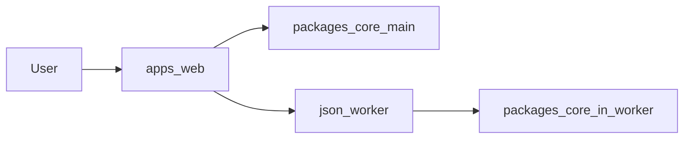
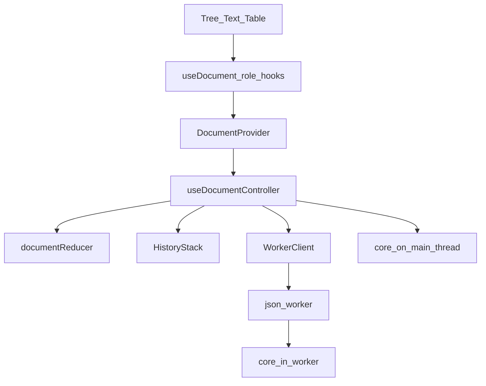
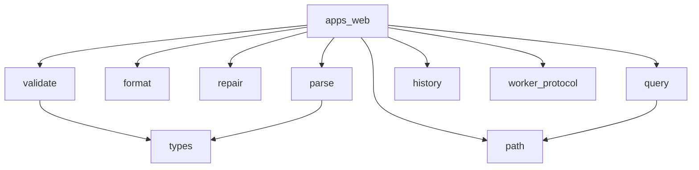
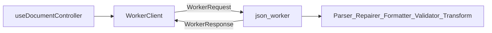

# JSON Editor architecture

This document gives the high-level system architecture of the json-editor
monorepo.

## Purpose and scope

JSON Editor is a **browser** app for viewing, editing, formatting, repairing,
transforming, and validating JSON documents.

This file covers:

- The monorepo package map
- Document state and controller data flow
- Core domain modules and the Web Worker protocol
- UI layering and the three editor views
- Extension points and verification layout

This file does **not** cover:

- Full usage and setup — see [README.md](../../README.md)
- Coding conventions and non-goals — see [json-editor-conventions](../rules/json-editor-conventions.mdc)
- Testing defaults — see [vitest-web-testing](../skills/vitest-web-testing/SKILL.md)
- Agent index — see [AGENTS.md](../../AGENTS.md)

## System context

The user edits a JSON document in the browser SPA (`apps/web`).
The UI keeps editor state on the main thread and calls `@json-editor/core` for
pure domain work.
Heavy parse / repair / format / validate / transform jobs run in a Web Worker
that also uses `@json-editor/core`.

There is no backend.
File open/save uses the browser file APIs.



## Package map

| Path | Package | Role |
| ---- | ------- | ---- |
| `apps/web` | `@json-editor/web` | React UI (tree, text, table), worker host, file I/O |
| `packages/core` | `@json-editor/core` | Parse, format, repair, validate, transform, path, history, worker types |

Core is framework-free.
Web owns React, CodeMirror, and browser adapters.

## Document data flow

Bootstrap: [`apps/web/src/index.tsx`](../../apps/web/src/index.tsx) →
[`app.tsx`](../../apps/web/src/app.tsx) →
[`pages/Editor`](../../apps/web/src/pages/Editor/index.tsx) inside
`DocumentProvider`.

[`useDocumentController`](../../apps/web/src/hooks/use-document-controller.ts)
owns:

- `useReducer` state via [`document-reducer.ts`](../../apps/web/src/stores/document-reducer.ts)
- Undo/redo via `HistoryStack` from core (coalescing policy in
  [`history-policy.ts`](../../apps/web/src/hooks/document-controller/history-policy.ts))
- Worker lifecycle and editor actions (parse, format, repair, validate, transform, file)

Dependencies are injected through
[`DocumentControllerDeps`](../../apps/web/src/hooks/document-controller/deps.ts)
(`createWorker`, `formatter`, `transformEngine`, `fileIo`, `createHistory`,
`createParser`).

UI consumes narrow role hooks from
[`use-document.ts`](../../apps/web/src/hooks/use-document.ts)
(`useDocumentState`, `useDocumentHistory`, `useDocumentFile`, and related),
not a fat controller API by default.

Typical text → JSON path:

1. View calls `setText`.
2. Controller debounces parse.
3. `WorkerClient` runs a `parse` job (local fallback when needed).
4. Reducer updates `json` / parse errors; history may push a snapshot.

Typical JSON → text path:

1. View or action calls `setJson`.
2. Local `JsonFormatter.beautify` updates text.
3. Pending parse work is cancelled.



## Core module map

| Area | Path under `packages/core/src` | Role |
| ---- | ------------------------------ | ---- |
| parse | `parse/` | `JSON.parse` wrapper; structured `ParseError` |
| format | `format/` | Beautify / compact via `JSON.stringify` |
| repair | `repair/` | Invalid JSON repair (`jsonrepair`) |
| validate | `validate/` | Ajv schema validation; `CompositeValidator` |
| transform | `query/` | Filter / sort / pick / limit DSL at a `rootPath` |
| path | `path/` | Get / set / delete / rename at JSON paths |
| history | `history/` | Bounded undo/redo stack |
| worker | `worker/protocol.ts` | Shared job / request / response types |
| detect | `detect/` | Leaf heuristics (color, timestamp) for tree UI |
| types | `types/` | `JsonValue`, `JsonPath`, validation types |

Prefer `I*` interfaces with concrete adapters (`JsonParser`, `JsonFormatter`,
`SchemaValidator`, `TransformEngine`, `HistoryStack`).



## Worker protocol

Shared types live in
[`packages/core/src/worker/protocol.ts`](../../packages/core/src/worker/protocol.ts).

| Job | Input | Success result |
| --- | ----- | -------------- |
| `parse` | text | JSON value |
| `repair` | text | repaired text |
| `format` | value + beautify/compact | text |
| `validate` | value + optional schema | validation issues |
| `transform` | value + `TransformProgram` | JSON value |

Envelope: `{ id, job }` → `{ id, ok: true, result }` or
`{ id, ok: false, error, parseError? }`.

- Client: [`apps/web/src/services/worker-client.ts`](../../apps/web/src/services/worker-client.ts)
  (correlation by `id`, timeout, respawn on crash)
- Worker: [`apps/web/src/workers/json-worker.ts`](../../apps/web/src/workers/json-worker.ts)
  (wires core adapters and dispatches by job type)

Document size thresholds for UX warnings live in
[`packages/core/src/constants.ts`](../../packages/core/src/constants.ts)
(`LARGE_DOCUMENT_BYTES`, `HUGE_DOCUMENT_BYTES`).



## UI layers

Under `apps/web/src/components/`:

| Layer | Role | Examples |
| ----- | ---- | -------- |
| `core` | Leaf controls | Button, Input, Select, Toolbar |
| `patterns` | Composed controls | ModeSwitch, SearchReplaceBar, StatusBar, leaf popovers |
| `containers` | Feature blocks | TreeView, TextView, TableView, SchemaPanel, TransformPanel |
| `layouts` | Page shell | EditorLayout |

The Editor page composes layout, toolbar, mode switch, search, and side panels.

Views:

- **Tree** — virtualized tree; path edits; detect popovers for colors/timestamps
- **Text** — CodeMirror; external sync helpers keep editor and document state aligned
- **Table** — array-of-objects grid with cell edits

App code imports components by **direct module path** (for example
`components/core/Button/index.js`). Do not add layer `index.ts` barrels under
`components/core`, `patterns`, `containers`, or `layouts` — Biome
`noBarrelFile` and React Doctor `no-barrel-import` both forbid them.

## Extension points

| Extension | Where | Role |
| --------- | ----- | ---- |
| `IJsonParser` / `IJsonFormatter` / `IJsonRepairer` / `IJsonValidator` / `ITransformEngine` / `IHistoryStack` | `packages/core` | Swap domain adapters |
| `DocumentControllerDeps` | `apps/web` hooks | Inject worker, file I/O, formatter, history in tests |
| Custom validators | `apps/web` utils + `CompositeValidator` | Extra rules beyond JSON Schema |
| Transform DSL | `TransformProgram` in core `query/` | Filter, sort, pick, limit programs |

Do not pull React into `packages/core`.

## Verification and agent layout

Local verify (CI parity):

```bash
pnpm verify
```

That runs Biome CI, typecheck, tests, lockfile validation, and `pnpm audit`.
After React edits, also run `pnpm run doctor:changed` (or `/doctor`).

Unit tests are colocated as `*.test.ts(x)`.
Prefer pure extracts over mounting React or CodeMirror.

Agent support lives under `.agents/`:

- `rules/` — monorepo, web, and core policy
- `skills/` — structure, SOLID, JSDoc, react-doctor, vitest
- `commands/` — `/verify`, `/doctor`, `/skills-check`
- `hooks/` — Biome + advisory React Doctor after file edit
- `docs/` — this architecture file

See [AGENTS.md](../../AGENTS.md) for the full index.
